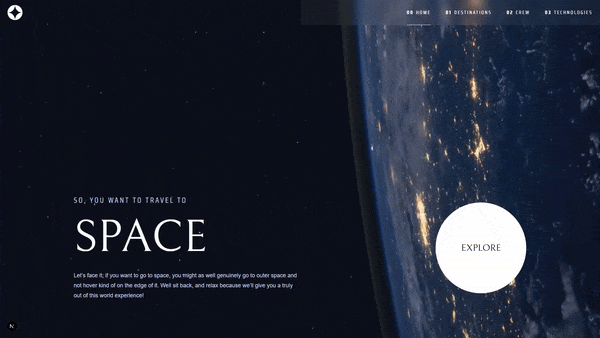

# Space Tourism Website

## Overview

Space Tourism is a sleek and modern web application built to simulate a futuristic travel experience. Users can explore various space destinations, meet crew members, and learn about space technologies. This project leverages a headless CMS architecture with a decoupled frontend for flexibility and scalability.

[Design](https://www.frontendmentor.io/challenges/space-tourism-multipage-website-gRWj1URZ3)

### Pages

- Home: A sleek hero section introducing the concept of space tourism with a call-to-action to explore destinations.

- Destinations: Users can explore different celestial bodies including the Moon, Mars, Europa, and Titan. Each destination includes a description, average distance, and estimated travel time.

- Crew: This section introduces key crew members like the Commander, Pilot, and Mission Specialists. It includes their roles, bios, and photos, with a tab-based navigation.

- Technologies: Highlights three major technologies used in space travel, such as the launch vehicle and space capsule, with a choice between portrait and landscape images for responsive display.

## Technologies Used

- Next.js: React framework for server-side rendering and optimized performance.

- Tailwind CSS: Provides utility-first styling for a responsive design.

- GSAP : High-performance animations and transitions.

- Context API: A built-in state management solution for efficient global data handling.

- headless Wordpress: CMS for content management, used via REST API.

- REST API: Communication layer for fetching dynamic content from WordPress.

- Docker : Containerized backend environment for easy development and deployment.

## Features

- Responsive Design: Optimized for all screen sizes (mobile, tablet, desktop)

- Modular Components: Well-structured, reusable components for easy maintenance and scalability.

- State Management: Efficient data handling with the Context API, providing a smooth state transition across components.

- Smooth Animations: Engaging user experience using GSAP.

- Dynamic Carousels: Tab and slider components for interactive navigation

## Media

